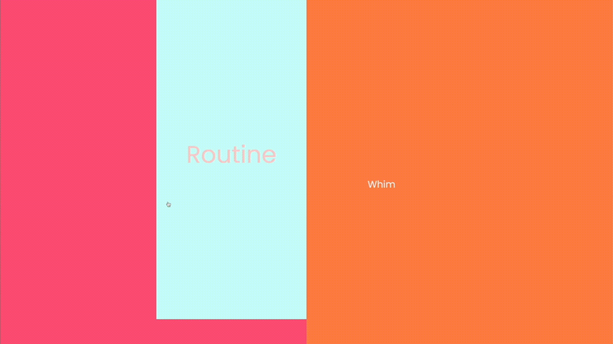
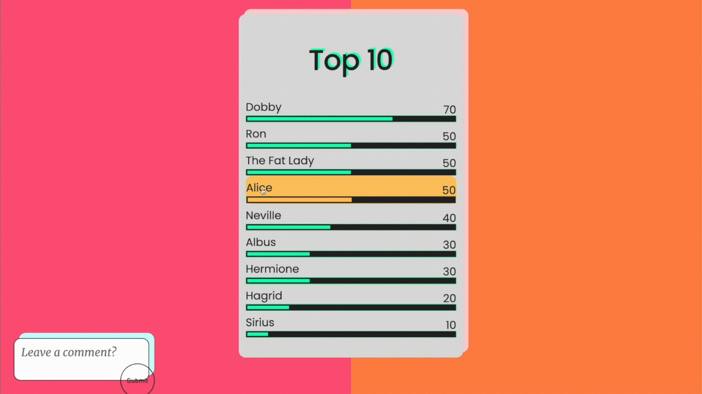

# This Or That!
This is a single page application simulating the game This Or That. The frontend is written in Javascript, HTML, and CSS. The Backend API is built with Ruby on Rails. The entire application is written in Ajax calls, meaning that it interacts with the user by dynamically rewriting portions of the web page with new data from the web server, instead of reloading the entire web page. Data is communicated between the front-end and back-end using ES6 syntax ```fetch```.


With this app, you will be able to:
- Select a card and see if your choice coincides with mine
- See statistics of others playing the game 
- Accumulate a score and submit your name 
- See others' scores and ranking 
- See others' comments and leave a comment of your own




## Demo
For a longer demo of the game, visit: https://sophieqgu.medium.com/project-demo-this-or-that-app-javascript-html-css-ruby-on-rails-7cb61a7f5cb7

## How to Play
Simply download and cd into the project folder.
```
$cd /path
```

Make sure to install all dependencies.
```
$bundle install
```
Configure database and start Rails server.
```
$rake db:migrate
$rake db:seed
$rails server
```
Open the index.html file in browser and start the game!
